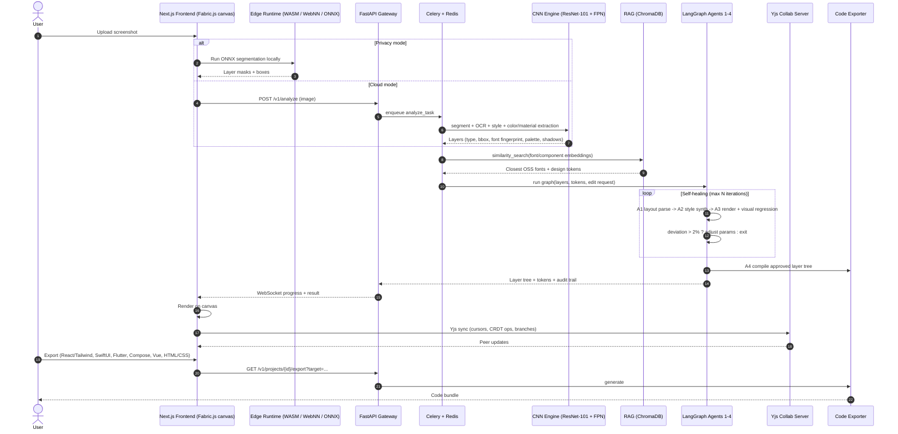

# Aether AI Screenshot Studio — Architecture

## End-to-end sequence

## Stack
| Layer | Choice |
|---|---|
| Frontend | Next.js (App Router), TypeScript, Tailwind, Fabric.js, Yjs, onnxruntime-web (WASM/WebNN) |
| API | FastAPI, Pydantic v2, WebSockets |
| Vision | PyTorch, torchvision (ResNet-101 + FPN), OCR (PaddleOCR/TrOCR), diffusers (inpainting) |
| RAG | ChromaDB (swap: Pinecone/FAISS), sentence-transformers / CLIP embeddings |
| Agents | LangGraph (state machine + reflection loop) |
| Async | Celery + Redis |
| Collab | Yjs + pycrdt-websocket, Redis pub/sub for scale-out |
| Observability | Structured audit log (JSONL/Postgres) streamed to UI |

## Honest scope notes
- Pretrained weights come from torchvision; **segmentation heads, font classifier and UI-layer classes must be trained** on a UI dataset (e.g. RICO, WebUI, synthetic renders). This repo is the pipeline, not trained weights.
- "1M+ fonts" is a corpus you must ingest (Google Fonts is ~1.5k families; add Fontsource etc.); see `rag/store.py`.
- Pixel-perfect kerning recovery from a raster is approximate; the visual-regression loop is what converges it.

---
# v2 additions

## Self-healing loop (as implemented)
Agent 3 renders the requested edits, then measures **(a)** drift outside edited regions and **(b)** background mismatch between the edited region and its surrounding ring.
If `max(a, b) > 2%` the `heal` node applies closed-loop correction (background bias += 0.85 x signed error) and re-renders — up to 6 passes. Covered by `tests/test_core.py::test_self_healing_converges` (an injected colour cast is detected at ~4-5% and healed to <= 2%).
Known limit: correction happens before 8-bit clipping, so a region already saturated (pure white/black) has no headroom to correct.

## Runtime tiers
| Tier | Detection | RAG | Orchestration |
|---|---|---|---|
| Core (`requirements.txt`) | classical CV (`cv/classical.py`) | built-in lite font catalog | built-in graph runner |
| ML (`requirements-ml.txt`) | ResNet-101 + FPN (`AETHER_WEIGHTS`) | ChromaDB + sentence-transformers | LangGraph |

## Feature map
| Area | Where |
|---|---|
| Layer intelligence, palette/gradient/shadow | `cv/classical.py`, `cv/pipeline.py` |
| Smart erase, outpainting, text replacement | `services/editing.py` |
| WCAG A/AA/AAA audit + auto-fix, colour-blindness sim | `services/a11y.py` |
| 50+ languages, metric-preserving fit | `services/i18n.py` |
| 7 exporters (React, HTML/CSS, Vue, SwiftUI, Flutter, Compose, Figma JSON) | `services/exporters.py` |
| Natural-language / voice commands | `services/nlcmd.py`, `components/Studio.tsx` |
| Dark-mode variant generator | `services/darkmode.py` |
| Audit log + live counters (WebSocket) | `services/telemetry.py` |
| JWT auth | `auth.py` |
| CRDT collab + branches | `collab/server.py`, `frontend/lib/collab.ts` |
| Edge inference (WebNN/WebGPU/WASM) | `frontend/lib/edge.ts` |
| Zero-backend private demo | `demo/index.html` |

## API
`POST /v1/analyze` · `POST /v1/projects/{id}/{erase|replace-text|outpaint|translate|darkmode|command|undo}` · `GET /v1/projects/{id}/{export|a11y|image|cvd/{kind}}` · `GET /v1/telemetry` · `WS /v1/telemetry/ws` · `POST /v1/auth/{register|login}` · `GET /v1/about` · `GET /healthz`

Designed & built by **Nikhil Chary Sriramoju**.
